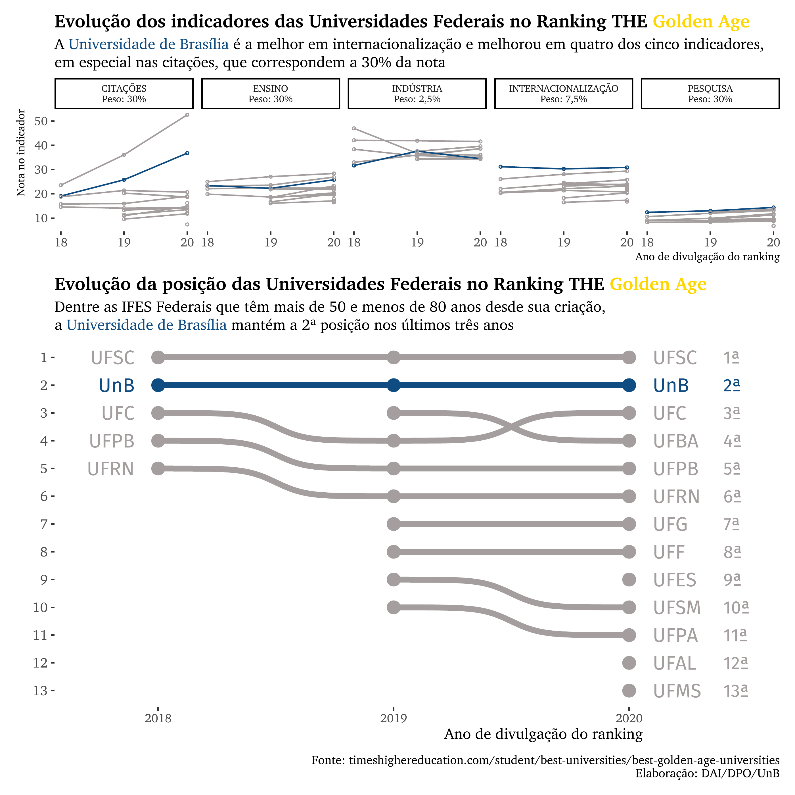
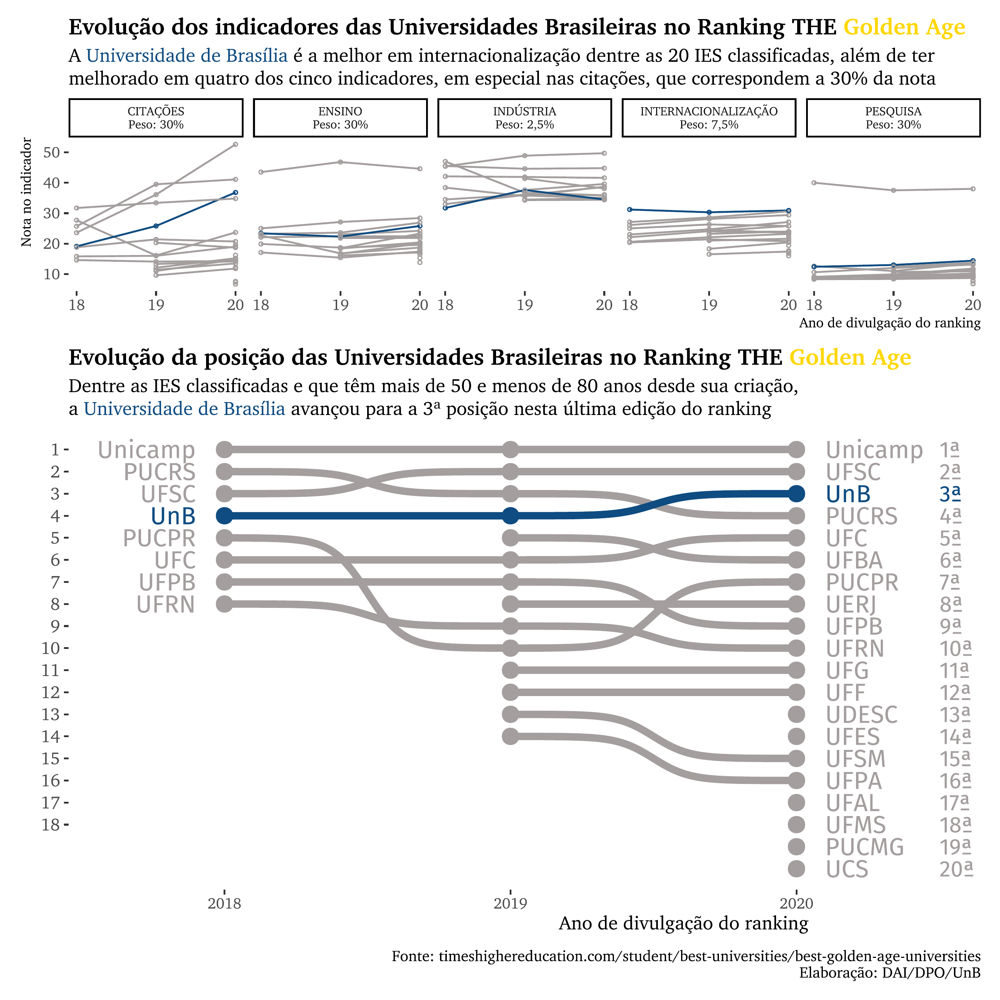

# THE GOLDEN AGE Ranking

# Data analysis of the Times Higher Education Golden Age ranking in Brazil

For this project, I extracted the HTML tables from separate articles in the timeshighereducation.com website. Since Brazil started to appear in this ranking (2018), I tracked down each publication that contained the results (below) and copied it into an Excel spreadsheet. I plan to automatize the raw data collection step soon.

- 2018 results: https://www.timeshighereducation.com/world-university-rankings/young-university-rankings-2018-golden-age-results-out-now
- 2019 results: https://www.timeshighereducation.com/cn/world-university-rankings/young-university-rankings-2019-golden-age-results-out-now
- 2020 results: https://www.timeshighereducation.com/world-university-rankings/young-university-rankings-2020-golden-age-results-out-now

The process is streamlined into three phases: data preparation (01_gera_dados.R), data visualization in the federal sphere (02_graficos_federais.R) and data visualization of all ranked Brazilian universities (03_graficos_nacional.R). For better control of the workflow, all these steps were grouped in a single script (00_executa_analise.R).

In all visualizations, I choose to highlight UnB (University of Brasília) to benchmark its performance in two different perspectives: against its federal peers and country-wise.

The results suggest that UnB is doing very well despite its dwindling resources: improvements in all but one dimension (industry), especially in the citation dimension, which is growing substantially every year.

Another point worthy of note is regarding the international outlook dimension - in both perspectives (federal and national) UnB is the best institution.

Below are the two plots discussed.

 

